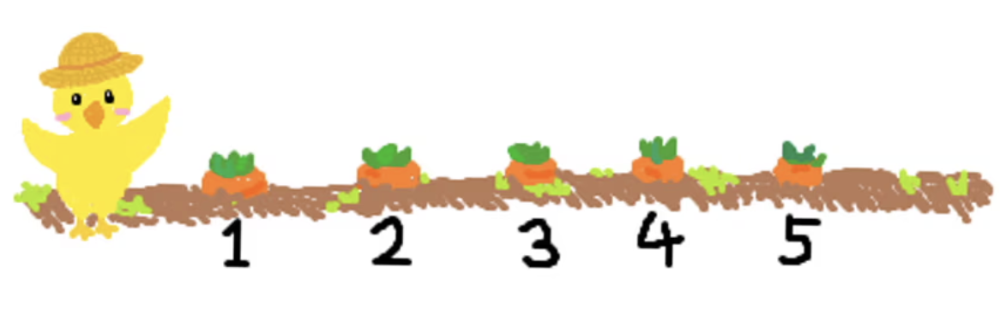

[당근 훔쳐먹기](https://www.acmicpc.net/problem/18234)

시간 제한	메모리 제한	제출	정답	맞힌 사람	정답 비율
1 초	512 MB	1166	542	432	44.953%
문제
꽉꽉나라의 농부 오리는 아무것도 심어져 있지 않은 텃밭을 하나 가지고 있다. 오리는 그 텃밭에 N종류의 당근을 하나씩 심고 T일 동안 재배할 예정이다.

당근 i(1 ≤ i ≤ N)는 처음에는 wi의 맛을 가지고 있고, 각 당근 i에 사용할 pi만큼 맛을 증가시켜주는 영양제가 당근 종류별로 T개씩 준비되어 있다. 오리는 당근이 본래의 맛보다 훨씬 맛있어지기를 바라기 때문에 pi는 항상 wi이상의 값을 가지도록 준비했다. 잠이 많은 오리는 매일 오전에만 텃밭에 나와 당근들을 관리한다. 오리는 각 당근 i에 대해 당근 i가 자리에 없다면 당근 i를 심고, 그렇지 않다면 당근 i에 영양제를 하나 준다.



꽉꽉나라에 놀러 온 토끼는 오리가 오전에만 당근을 관리한다는 사실을 알고 오리의 텃밭을 찾아가 당근을 훔쳐 먹을 계획을 세웠다. 토끼는 위장이 작아서 하루에 최대 하나의 당근을 먹을 수 있고 당근을 먹지 않을 수도 있다. 또한 당근 하나를 먹기로 마음먹으면 남기지 않고 먹으며, 오리와 마주치지 않기 위해 오후에만 텃밭에 찾아간다. 토끼는 자신이 먹은 당근의 맛의 합을 최대로 하고 싶어 한다.

T일 동안 토끼가 먹을 수 있는 당근의 맛의 합의 최댓값을 구해보자.

입력
첫 번째 줄에 N(1 ≤ N ≤ 200,000)과 T(N ≤ T ≤ 100,000,000)가 공백으로 구분되어 주어진다. 오리는 당근의 맛을 충분히 높이기 위해 항상 N이상인 T일 동안 재배한다.

다음 N개의 줄에 걸쳐서 i+1번째 줄에 당근 i의 wi와 pi가 공백으로 구분되어 주어진다. (1 ≤ i ≤ N, 1 ≤ wi ≤ pi ≤ 100, wi와 pi는 정수)

출력
첫 번째 줄에 토끼가 T일 동안 먹을 수 있는 당근의 맛의 합의 최댓값을 출력한다. 정답은 32비트 정수 변수(int) 범위를 초과할 수 있기 때문에 64비트 정수 변수(C/C++ : long long, JAVA : long)를 사용해야 한다.

예제 입력 1 
```
2 2
3 4
1 2
```
예제 출력 1 
```
8
```
1일차 오전에 오리는 당근 1과 2를 심는다. 그날 오후 토끼는 1만큼 맛있는 당근 2를 뽑아먹는다.

2일차 오전에 오리는 당근 2를 심고 당근 1에 영양제를 하나 준다. 그날 오후 토끼는 7만큼 맛있는 당근 1을 뽑아먹는다.

예제 입력 2 
```
3 5
1 3
2 9
3 7
```
예제 출력 2 
```
69
```
예제 입력 3 
```
6 10
1 10
2 9
3 8
3 5
6 6
5 6
```

예제 출력 3 
```
324
```