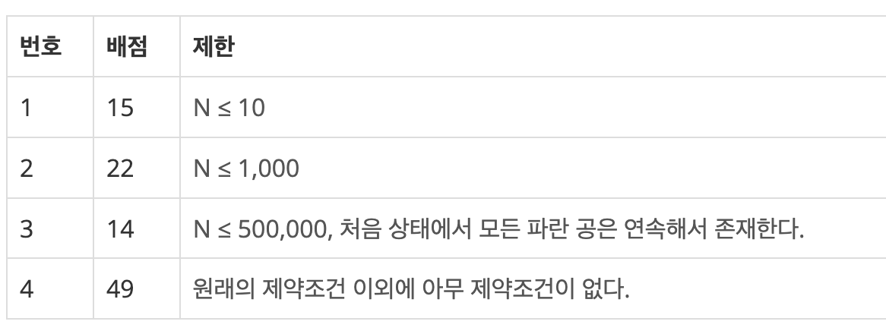

[볼 모으기](https://www.acmicpc.net/problem/17615)

시간 제한	메모리 제한	제출	정답	맞힌 사람	정답 비율
1 초 (추가 시간 없음)	512 MB	8362	3447	2703	41.732%

---

문제
빨간색 볼과 파란색 볼이 <그림 1>에서 보인 것처럼 일직선상에 섞여 놓여 있을 때, 볼을 옮겨서 같은 색 볼끼리 인접하게 놓이도록 하려고 한다. 볼을 옮기는 규칙은 다음과 같다.

바로 옆에 다른 색깔의 볼이 있으면 그 볼을 모두 뛰어 넘어 옮길 수 있다. 즉, 빨간색 볼은 옆에 있는 파란색 볼 무더기를 한 번에 뛰어 넘어 옮길 수 있다. 유사하게, 파란색 볼은 옆에 있는 빨간색 볼 무더기를 한 번에 뛰어 넘어 옮길 수 있다.
옮길 수 있는 볼의 색깔은 한 가지이다. 즉, 빨간색 볼을 처음에 옮겼으면 다음에도 빨간색 볼만 옮길 수 있다. 유사하게, 파란색 볼을 처음에 옮겼으면 다음에도 파란색 볼만 옮길 수 있다.
예를 들어, 처음에 볼이 <그림 1>에서 보인 것처럼 있을 때, 빨간 볼을 <그림 2>에서 보인 것처럼 옮긴 후, <그림 3>에서 보인 것처럼 옮긴다면 두 번 만에 같은 색끼리 모을 수 있다.


<그림 1>


<그림 2>


<그림 3>


반면에 파란색 볼을 선택하여 에서 보인 것처럼 옮기면(화살표에 있는 수는 옮기는 순서를 나타낸다) 네 번을 옮겨야 같은 색의 볼끼리 모을 수 있다.


<그림 4>


일직선상에 놓여 있는 볼에 관한 정보가 주어질 때, 규칙에 따라 볼을 이동하여 같은 색끼리 모으되 최소 이동횟수를 찾는 프로그램을 작성하시오.

입력
첫 번째 줄에는 볼의 총 개수 N이 주어진다. (1 ≤ N ≤ 500,000) 다음 줄에는 볼의 색깔을 나타내는 문자 R(빨간색 볼) 또는 B(파란색 볼)가 공백 없이 주어진다. 문자열에는 R 또는 B 중 한 종류만 주어질 수도 있으며, 이 경우 답은 0이 된다.

출력
최소 이동횟수를 출력한다.

서브태스크


예제 입력 1 
```
9
RBBBRBRRR
```
예제 출력 1 
```
2
```
예제 입력 2 
```
8
BBRBBBBR
```
예제 출력 2 
```
1
```
